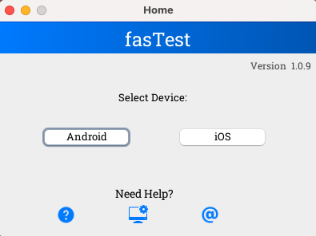
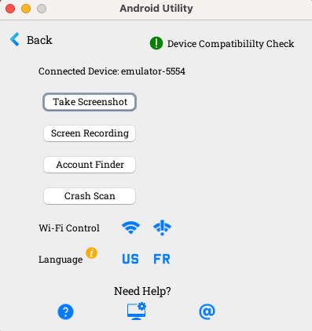
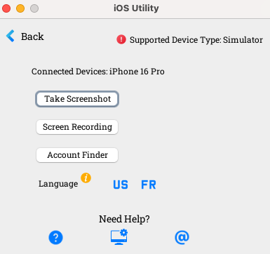
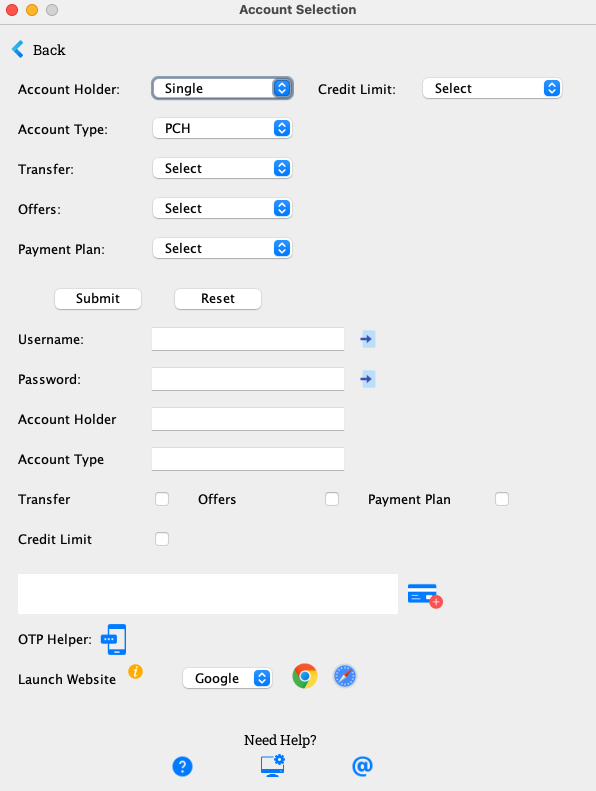

# fasTest

## Table of Contents
1. [Overview](#1-overview)
2. [Home Screen](#2-home-screen)
    1. [Features](#21-features)
        1. [Device Selection](#211-device-selection)
        2. [Loading Indicators](#212-loading-indicators)
        3. [Version Information](#213-version-information)
        4. [Help Options](#214-help-options)
    2. [Usage](#22-usage)
        1. [Starting the Application](#221-starting-the-application)
        2. [Selecting a Device](#222-selecting-a-device)
        3. [Viewing Version Information](#223-viewing-version-information)
3. [AndroidUtility Screen](#3-androidutility-screen)
    1. [About](#31-about)
    2. [Features](#32-features)
        1. [Device Status Monitoring](#321-device-status-monitoring)
        2. [Screenshot and Screen Recording](#322-screenshot-and-screen-recording)
        3. [Crash Log Scanning](#323-crash-log-scanning)
        4. [Wi-Fi Control](#324-wi-fi-control)
        5. [Language Settings](#325-language-settings)
    3. [Usage](#33-usage)
        1. [Starting the Application](#331-starting-the-application)
        2. [Recording Actions](#332-recording-actions)
        3. [Taking a Screenshot](#333-taking-a-screenshot)
        4. [Recording the Screen](#334-recording-the-screen)
        5. [Scanning for Crashes](#335-scanning-for-crashes)
        6. [Controlling Wi-Fi](#336-controlling-wi-fi)
        7. [Setting Device Language](#337-setting-device-language)
4. [iOSUtility Screen](#4-iosutility-screen)
    1. [Overview](#41-overview)
    2. [Features](#42-features)
        1. [Device Status Monitoring](#421-device-status-monitoring)
        2. [Screenshot and Screen Recording](#422-screenshot-and-screen-recording)
        3. [Language Settings](#423-language-settings)
    3. [Usage](#43-usage)
        1. [Starting the Application](#431-starting-the-application)
        2. [Taking a Screenshot](#432-taking-a-screenshot)
        3. [Recording the Screen](#433-recording-the-screen)
        4. [Setting Device Language](#434-setting-device-language)
5. [AccountSelectionGUI](#5-accountselectiongui)
    1. [About](#51-about)
    2. [Account Selection Screen](#52-account-selection-screen)
    3. [Features](#53-features)
        1. [Account Selection](#531-account-selection)
        2. [User Credentials](#532-user-credentials)
        3. [Quick Actions](#533-quick-actions)
        4. [Browser Integration](#534-browser-integration)
        5. [Help Options](#535-help-options)
    4. [Usage](#54-usage)
        1. [Starting the Application](#541-starting-the-application)
        2. [Selecting an Account](#542-selecting-an-account)
        3. [Resetting Fields](#543-resetting-fields)
        4. [Quick Text Entry](#544-quick-text-entry)
        5. [Using OTP Helper](#545-using-otp-helper)
        6. [Launching Websites](#546-launching-websites)
6. [Dependencies](#6-dependencies)
7. [License](#7-license)
8. [Contact](#8-contact)

## 1. Overview

The `fasTest` Desktop app is a user-friendly application designed to facilitate the selection and management of Android and iOS utilities. This application provides a graphical interface to launch specific utilities for Android and iOS devices, making it easier for users to perform various device management tasks.

## 2. Home Screen

  

<b>Home screen</b>

### 2.1 Features

#### 2.1.1 Device Selection
- **Select Device**: Allows users to choose between Android and iOS devices for further actions.

#### 2.1.2 Loading Indicators
- **Loading Message and Icon**: Displays a loading message and icon while the selected utility is being loaded, providing visual feedback to the user.

#### 2.1.3 Version Information
- **Version Display**: Shows the current version of the application and provides a clickable link to download the latest version.

#### 2.1.4 Help Options
- **HelpOptionsPanel**: Provides additional help and options for users, ensuring they have access to necessary information and support.

### 2.2 Usage

#### 2.2.1 Starting the Application
To start the `fasTest` application, run the `main` method in the `fasTest` class. The main window will appear, displaying options to select either an Android or iOS device.

#### 2.2.2 Selecting a Device
1. **Select Device**: Click the "Android" or "iOS" button to choose the respective device.
2. **Loading Indicator**: A loading message and icon will appear, indicating that the selected utility is being loaded.
3. **Utility Screen**: The corresponding utility screen (Android or iOS) will be displayed, allowing further device management actions.

#### 2.2.3 Viewing Version Information
- **Version Label**: The version label at the top right corner displays the current version of the application.
- **Download Latest Version**: Click the version label to open a web browser and navigate to the download page for the latest version of the application.

## 3. AndroidUtility Screen

### 3.1 About

The `AndroidUtility` screen is a comprehensive utility tool designed to assist with various Android device management tasks. This application provides a user-friendly interface to perform actions such as taking screenshots, recording the screen, scanning for crashes, controlling Wi-Fi, and setting device language. It is built using Java and Swing for the graphical user interface.

  

<b>Android Utility screen</b>

### 3.2 Features

#### 3.2.1 Device Status Monitoring
- **Device Connection Status**: Displays the connection status of Android devices, including the number of connected devices and their details.

#### 3.2.2 Screenshot and Screen Recording
- **Take Screenshot**: Capture and save screenshots of the connected Android device.
- **Screen Recording**: Opens a New Window to Record the screen of the connected Android device with optimized settings for resolution, frame rate, and bitrate.

#### 3.2.3 Crash Log Scanning
- **Crash Scan**: Scan the device logs for crashes and display the results.

#### 3.2.4 Wi-Fi Control
- **Enable Wi-Fi**: Turn on the Wi-Fi on the connected Android device.
- **Disable Wi-Fi**: Turn off the Wi-Fi on the connected Android device.

#### 3.2.5 Language Settings
- **Set Language to English**: Change the device language to English.
- **Set Language to French**: Change the device language to French.

### 3.3 Usage

#### 3.3.1 Starting the Application
To start the `AndroidUtility` application, run the `main` method in the `AndroidUtility` class. The main window will appear, displaying various buttons and options for managing the connected Android device.

#### 3.3.2 Recording Actions
1. **Start Recording**: Click the "Start Recording" button to begin logging user actions.
2. **Perform Actions**: Interact with the application (e.g., take a screenshot, enable Wi-Fi).
3. **Stop Recording**: Click the "Stop Recording" button to stop logging actions and save them to a text file on the desktop.

#### 3.3.3 Taking a Screenshot
Click the "Take Screenshot" button to capture the current screen of the connected Android device. The screenshot will be saved to the desktop.

#### 3.3.4 Recording the Screen
Click the "Screen Recording" button to start recording the screen of the connected Android device. The recording will be saved with optimized settings for better performance and file size.

#### 3.3.5 Scanning for Crashes
Click the "Crash Scan" button to scan the device logs for crashes. The results will be displayed in the application.

#### 3.3.6 Controlling Wi-Fi
- **Enable Wi-Fi**: Click the "Wi-Fi On" button to turn on the Wi-Fi on the connected device.
- **Disable Wi-Fi**: Click the "Wi-Fi Off" button to turn off the Wi-Fi on the connected device.

#### 3.3.7 Setting Device Language
- **Set Language to English**: Click the "EN" button to change the device language to English.
- **Set Language to French**: Click the "FR" button to change the device language to French.

## 4. iOSUtility Screen

### 4.1 Overview

The `iOSUtility` class is a comprehensive utility tool designed to assist with various iOS device management tasks. This application provides a user-friendly interface to perform actions such as taking screenshots, recording the screen, and setting device language. It is built using Java and Swing for the graphical user interface.

  

<b>iOS Utility screen</b>

### 4.2 Features

#### 4.2.1 Device Status Monitoring
- **Device Connection Status**: Displays the connection status of iOS devices, including the number of connected devices and their details.

#### 4.2.2 Screenshot and Screen Recording
- **Take Screenshot**: Capture and save screenshots of the connected iOS device.
- **Screen Recording**: Record the screen of the connected iOS device with optimized settings for resolution, frame rate, and bitrate.

#### 4.2.3 Language Settings
- **Set Language to English**: Change the device language to English.
- **Set Language to French**: Change the device language to French.

### 4.3 Usage

#### 4.3.1 Starting the Application
To start the `iOSUtility` application, run the `main` method in the `iOSUtility` class. The main window will appear, displaying various buttons and options for managing the connected iOS device.

#### 4.3.2 Taking a Screenshot
Click the "Take Screenshot" button to capture the current screen of the connected iOS device. The screenshot will be saved to the desktop.

#### 4.3.3 Recording the Screen
Click the "Screen Recording" button to start recording the screen of the connected iOS device. The recording will be saved with optimized settings for better performance and file size.

#### 4.3.4 Setting Device Language
- **Set Language to English**: Click the "EN" button to change the device language to English.
- **Set Language to French**: Click the "FR" button to change the device language to French.

## 5. AccountSelectionGUI

### 5.1 About

The `AccountSelectionGUI` class is a graphical user interface designed to facilitate the selection and management of various account types. This application provides a user-friendly interface to perform actions such as selecting account holders, account types, transfer eligibility, offers, payment plans, and credit limits. It is built using Java and Swing for the graphical user interface.

### 5.2 Account Selection Screen

  

<b>Account Selection screen</b>

### 5.3 Features

#### 5.3.1 Account Selection
- **Account Holder**: Select between single or multi account holders.
- **Account Type**: Choose between different account types such as PCH or Au.
- **Transfer Eligibility**: Select transfer eligibility status.
- **Offers**: Choose offer eligibility status.
- **Payment Plan**: Select payment plan eligibility status.
- **Credit Limit**: Choose credit limit eligibility status.

#### 5.3.2 User Credentials
- **Username and Password**: Enter and manage user credentials.

#### 5.3.3 Quick Actions
- **Quick Text Entry**: Quickly enter text to Android devices using ADB.
- **OTP Helper**: Quickly enter a stub OTP to Android devices.

#### 5.3.4 Browser Integration
- **Launch Websites**: Open selected websites in Chrome or Safari and input credentials automatically.

#### 5.3.5 Help Options
- **HelpOptionsPanel**: Provides additional help and options for users, ensuring they have access to necessary information and support.

### 5.4 Usage

#### 5.4.1 Starting the Application
To start the `AccountSelectionGUI` application, run the `main` method in the `AccountSelectionGUI` class. The main window will appear, displaying various buttons and options for managing accounts.

#### 5.4.2 Selecting an Account
1. **Select Account Holder**: Choose between single or multi account holders.
2. **Select Account Type**: Choose the account type.
3. **Select Transfer Eligibility**: Choose the transfer eligibility status.
4. **Select Offers**: Choose the offer eligibility status.
5. **Select Payment Plan**: Choose the payment plan eligibility status.
6. **Select Credit Limit**: Choose the credit limit eligibility status.
7. **Submit**: Click the "Submit" button to fetch and display account details.

#### 5.4.3 Resetting Fields
Click the "Reset" button to clear all fields and selections.

#### 5.4.4 Quick Text Entry
Click the keyboard icon next to the username or password field to quickly enter text to Android devices using ADB.

#### 5.4.5 Using OTP Helper
Click the OTP helper button to quickly enter a OTP to Android devices.

#### 5.4.6 Launching Websites
1. **Select Website**: Choose a website from the dropdown.
2. **Open in Chrome**: Click the Chrome icon to open the selected website in Chrome and input credentials using Selenium.
3. **Open in Safari**: Click the Safari icon to open the selected website in Safari and input credentials using Selenium.

## 6. Dependencies

- Java Development Kit (JDK)
- Swing (Java GUI toolkit)
- Android Studio (for Android utilities)
- SDK Platform Tools (for ADB commands)
- Android Emulator (for Android device emulation)
- Xcode (for iOS utilities)
- iOS Simulator (for iOS device emulation)
- Xcrun (for iOS device management)

## 7. License

This project is licensed under the MIT License. See the `LICENSE` file for more details.

## 8. Contact

For any questions or issues, please contact the project developer at [asrivignesh10@gmail.com].
